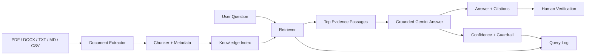
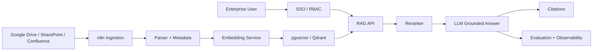

# Architecture

## Retrieval strategy

The project is deployment-safe by design:

1. Attempt Gemini semantic embeddings when configured and available.
2. If embeddings fail or are unavailable, automatically use a local hybrid lexical retrieval engine.
3. The answer layer still receives only retrieved evidence.

## Production architecture

