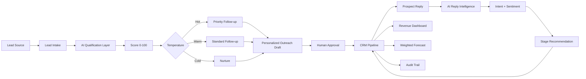

# Architecture

## Production extension
Lead source/webhook → n8n → AI qualification → HubSpot/Salesforce → approved email → reply webhook → AI intent classifier → CRM stage → Calendar → dashboard.
